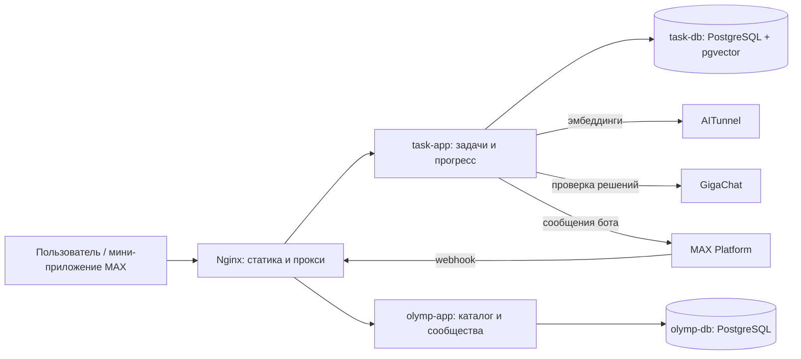

# Архитектура Gazprompt

Документ описывает текущую реализацию. Инструкции по запуску и миграциям находятся в [корневом README](../README.md), функции каждого API — в README [задач](../task_find_service/README.md) и [каталога](../olymp_find_service/README.md).

## Компоненты и связи



`frontend` отдаёт файлы из `ui/public/` и принимает внешний HTTPS на 443. `task-app` и `olymp-app` — отдельные приложения FastAPI; каждый сервис владеет своей базой. Compose задаёт им адреса друг друга, но сейчас прямых HTTP-вызовов между этими двумя сервисами в коде нет. Интерфейс обращается к обоим через Nginx.

| Компонент | Ответственность | Данные |
| --- | --- | --- |
| `ui/`, `frontend` | Страницы поиска, решения задач, статистики, подбора олимпиад и сообществ; проксирование API. | Статические файлы, временное состояние в браузере. |
| `task_find_service/`, `task-app` | Поиск и управление задачами, подсказки, проверка решения, MAX-аутентификация, сессии и прогресс. | `task-db`: задачи, решения, источники, классификатор, эмбеддинги, пользователи и решённые задачи. |
| `olymp_find_service/`, `olymp-app` | Каталог олимпиад, вузов и программ, рекомендации, офлайн-кружки и онлайн-сообщества. | `olymp-db`: каталог и сообщества. |

Базы используют разные идентификаторы олимпиад: в `task-db` это UUID справочника задач, в `olymp-db` — целочисленные ID каталога и связей предмета с олимпиадой. Автоматической синхронизации этих справочников нет.

## Основные потоки

1. **Поиск задачи.** Браузер вызывает `task-app` через Nginx. Сервис ищет по текстовому индексу PostgreSQL. При наличии `AITUNNEL_API_KEY` он дополнительно получает вектор запроса у AITunnel, сопоставляет его с сохранёнными эмбеддингами в `task-db` и объединяет результаты. Без ключа остаётся текстовый поиск. При создании или изменении опубликованной задачи эмбеддинги могут пересчитываться в фоновом задании.
2. **Проверка решения.** Браузер отправляет текст и/или файл в `POST /tasks/{task_id}/check`. `task-app` передаёт запрос модели `GigaChat-2-Pro` через GigaChat SDK и возвращает разбор с вердиктом. Если вердикт равен `0`, интерфейс отдельным запросом отмечает задачу решённой в `task-db`. Генерация подсказок и эталонных решений в `app/services/llm.py` пока возвращает заглушки; проверка ответа использует реальный внешний вызов.
3. **Вход и прогресс.** Клиент получает подписанный `initData` от MAX и отправляет его в `POST /api/max/validate`. `task-app` проверяет подпись токеном бота, создаёт или обновляет пользователя и выдаёт защищённую cookie-сессию. Маршруты `/progress/*` читают эту сессию. MAX также отправляет события бота на `/webhook`; сервис может отвечать сообщениями через API MAX.
4. **Подбор олимпиад.** Браузер запрашивает `olymp-app`; рекомендации строятся из таблиц олимпиад, предметов, вузов, программ и льгот в `olymp-db`. Сообщества читаются из отдельных таблиц этой же базы.

## Внешние провайдеры и настройки

| Провайдер | Вызов из кода | Настройки |
| --- | --- | --- |
| AITunnel | `POST https://api.aitunnel.ru/v1/embeddings`; эмбеддинги запроса и задач. | `AITUNNEL_API_KEY`, `EMBEDDING_MODEL`, `EMBEDDING_DIMENSION`. Текущая модель в примере — `qwen/qwen3-embedding-4b`, размерность — `2560`. Модель и размерность должны соответствовать векторам в БД; в SQL поиска также указан `halfvec(2560)`. |
| GigaChat | SDK обращается к `https://api.giga.chat/v1`, модель `GigaChat-2-Pro`; при необходимости загружает файл решения. | `GIGACHAT_CREDENTIALS`, `GIGACHAT_SCOPE`. |
| MAX | Вход по `initData`, входящий webhook и отправка сообщений через `https://platform-api2.max.ru/messages`. | `MAX_BOT_TOKEN`. `MAX_WEBHOOK_SECRET` передаётся контейнеру, но текущий код не подключает его к webhook; библиотека при инициализации предупреждает об этом. |

Секреты передаются через корневой `.env`; файл не хранится в Git. Для HTTPS-запросов образ `task-app` также требует доверенный сертификат из `certs/`, как описано в [инструкции развёртывания](../README.md).

## API и маршруты

Сохранённые [tasks-openapi.json](../tasks-openapi.json) и [olymp-openapi.json](../olymp-openapi.json) описывают **внутренние** пути FastAPI. Nginx преобразует внешние URL:

| Внешний путь | Внутренний путь | Сервис |
| --- | --- | --- |
| `/api/tasks/tasks` | `/tasks` | `task-app` |
| `/api/tasks/olympiads` | `/olympiads` | `task-app` |
| `/api/progress/statistics` | `/progress/statistics` | `task-app` |
| `/api/olympiads/olympiads/recommendations` | `/olympiads/recommendations` | `olymp-app` |
| `/api/olympiads/communities/clubs` | `/communities/clubs` | `olymp-app` |

Полные актуальные схемы работающих сервисов Nginx публикует по `/tasks-openapi.json` и `/olymp-openapi.json`. Корневой [DATA-API.yaml](../DATA-API.yaml) — отдельный выборочный контракт для платформы оценки MAX: в нём указан публичный `base_url`, поэтому его пути приведены к внешним URL. Он не заменяет полные OpenAPI-схемы.

Проверить сохранённые JSON-схемы против текущего кода можно без запуска БД, если установлены зависимости сервисов:

```bash
(cd task_find_service && MAX_BOT_TOKEN=schema-check python extract_openapi.py --check)
(cd olymp_find_service && python extract_openapi.py --check)
```

Без `--check` эти команды обновляют соответствующие JSON-файлы в корне репозитория. `DATA-API.yaml` поддерживается отдельно: это выборка маршрутов с публичными путями, а не автоматически сгенерированная схема FastAPI.

## Данные и обновления

`task-db` создаёт таблицы и расширения PostgreSQL из `task_find_service/sql/init.sql` при первом запуске пустого тома. Данные задач загружаются отдельно из внешнего SQLite-снимка через `import_etl.py`. `olymp-db` создаёт каталог из `init.sql` и загружает `seed.sql`; таблицы сообществ добавляются отдельными SQL-скриптами. Init-скрипты PostgreSQL не выполняются повторно на существующих томах, поэтому миграции применяются вручную перед обновлением версии, которой нужна новая схема.
